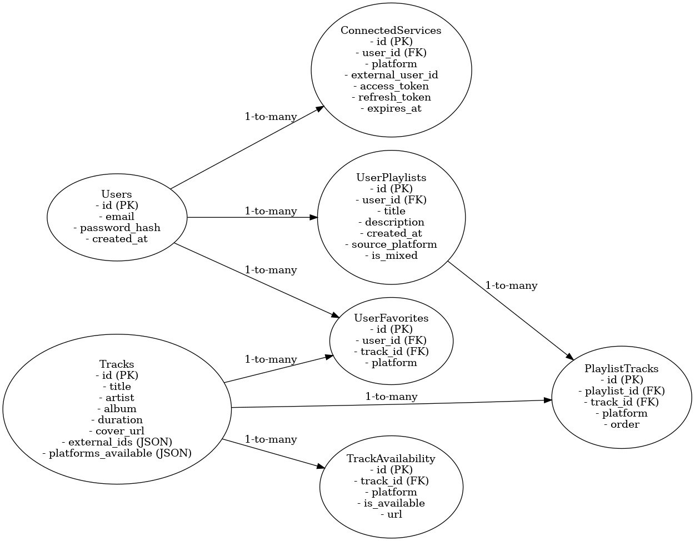

# Этапы разработки музыкального приложения: Чеклист

## Подготовительный этап. Инициализация и проектирование

- [x] Brainshtorm идей, фишек, названия и слоганов
- [x] Определения основных инструментов разработки
- [x] Инициализация проекта и закуск для проверки работы синрхонизации архитектурных компнентов
- [x] Дизайн и протопизиция при помощи Figma
- [x] Проектирование арзитектуры базы данных сервиса

## Этап I. Прототипирование (Local MVP)

- [ ] Реализация базового интерфейса (Vue 3 + Vite)
- [ ] Реализация backend API (FastAPI)
- [ ] Интеграция с OAuth 2.0 Spotify / YouTube / Yandex Music
- [ ] Подключение локальной БД (PostgreSQL, через SQLAlchemy)
- [ ] Внутреннее тестирование базового функционала (auth + импорт + поиск трека)
- [ ] Создание внутренней документации (Swagger/OpenAPI)

## Этап II. Виртуализация и развёртывание

- [ ] Развёртывание на Ubuntu Server 22.04 (VirtualBox)
- [ ] Установка и конфигурация: PostgreSQL, NGINX, Uvicorn/Gunicorn
- [ ] Настройка systemd-сервисов
- [ ] Подключение self-signed SSL-сертификатов
- [ ] Проверка доступа в локальной сети

## Этап III. Открытое тестирование

- [ ] Проброс порта / настройка ngrok
- [ ] Настройка CORS и авторизации для внешнего доступа
- [ ] Сбор фидбека от тест-группы (в т.ч. багрепорты и UX)
- [ ] Первая версия Terms of Use / Privacy Policy
- [ ] Настройка логирования и мониторинга (Sentry, Prometheus, UptimeRobot)

## Этап IV. Pre-Production

- [ ] Подготовка CI/CD пайплайна (GitHub Actions + SSH)
- [ ] Перенос на VPS (Hetzner/Timeweb)
- [ ] Настройка HTTPS (Let's Encrypt)
- [ ] Оптимизация безопасности (rate-limiting, CSRF, токены)
- [ ] Подготовка к лицензированию API-провайдеров
